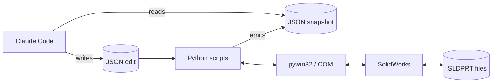

# SolidWorks CAD-edit toolkit, driven by an AI agent

## What this is

SolidWorks is a CAD program used for designing mechanical parts; almost everyone who uses it drives it by hand from inside the application. This project is a Python toolkit that lets an AI agent (Claude Code) read, render, edit, and verify SolidWorks parts from the outside, over the Windows COM bridge that SolidWorks ships with. The toolkit produces JSON snapshots Claude can read, accepts JSON edit files Claude can write, and refuses to run an edit unless every step validates and a backup is on disk. The COM bridge is well-known among SolidWorks developers for being undocumented at the corners, which is most of what made this project interesting.

## What I set out to prove

I started this project to answer two questions. First, can Claude make safe, declarative edits to a SolidWorks part — rename features, change dimensions, drill holes, swap materials — with rollback that actually rolls back when something goes wrong? CAD files are the kind of artifact you don't want a model to silently corrupt halfway through. Second, what does the SolidWorks/Python COM boundary actually behave like when you hit it from outside the SW UI? The documentation and the typed Python bindings disagree in places, and I wanted to find out where.

## How it works

The toolkit is four short Python scripts sitting on top of one shared helper (`_sw.py`). `describe_model.py` walks the open part and writes a JSON snapshot of every feature, dimension, custom property, and configuration. `render_views.py` saves PNGs of the standard views so Claude has something visual to refer to. `apply_edit.py` reads a JSON edit file — a list of declarative operations — and applies them with a validate-everything-first / `.bak`-before-write / post-edit rebuild-check / rollback-on-failure contract. `rebuild_check.py` runs that rebuild check and is also a module `apply_edit.py` imports. The shared helper `_sw.py` is where every workaround for COM's rough edges lives in one place — the four scripts above all go through it, so they don't each have to know the quirks.



A declarative edit operation looks like this:

```json
{"op": "set_dimension", "name": "D1@Base", "value": 100, "units": "mm"}
```

## What I learned

**On editing safely.** The validate-all-first / `.bak`-before-write / rebuild-check-after / rollback-on-failure contract works. `apply_edit.py` aborts the entire batch if any single operation fails its validation pass; if a validated operation throws at apply time, the file is restored from backup. The smoke roundtrip in `edits/smoke_roundtrip.json` exercises six dispatch paths in one idempotent batch: `rename_feature`, `set_dimension`, `set_dimension_tolerance`, `suppress_feature`, `unsuppress_feature`, and `set_active_configuration`. Single-op edits in `edits/` run clean for `drill_hole` and `rename`. The `set_material` attempt rolled back when `SetMaterialPropertyName2` turned out not to be exposed on the typed bindings — a 21st quirk surfaced during verification rather than corrupting the file, which is exactly what the safety contract is for. `delete_wizard_hole` rolled back because the target feature had already been deleted in a prior session, which is correct idempotent behavior.

**On the COM boundary.** The Windows COM bridge gives Python a list of method names to call on the SolidWorks application — over a thousand of them, with documentation that mostly assumes you're calling them from a VBA macro inside SolidWorks itself. From outside, things drift. I found 20 distinct issues between what the SolidWorks API docs claim and what the typed Python bindings actually do. They fall into four categories worth naming. Dispatch-mode ambiguity: depending on how Python connects to SolidWorks, the same call sometimes returns a value directly and sometimes returns a method you have to call to get the value. Every property access goes through a helper that handles both. Byref tuple returns where the docs imply a bool: `OpenDoc6` and `Save3` return `(result, errors, warnings)`, not the single value the signature suggests. Accessors the SolidWorks reference lists that aren't actually exposed: `FeatureByName` and `GetBodies2` are documented but missing, so the toolkit walks the feature tree by hand and casts the model to `IPartDoc` for body access. And creation calls that return `None` from script context with no documented preconditions: `HoleWizard5` and `FeatureCut4`. All 20 are pinned into `_sw.py` and the full catalogue lives in `QUIRKS.md`.

## What didn't fit

- `HoleWizard5` returns `None` from external Automation across every parameter combination I tried. I fell back to `SimpleHole2`.
- `FeatureCut4` returns `None` from script context even when the underlying sketch was created cleanly and is selected by name. The same call works from the SW UI on the same sketch.
- `AddDimension2` and `AddAlongXDimension` hang on the Modify dialog unless `swInputDimValOnCreate` (346) is set False first. Discovered the hard way.
- Assembly mate walking is stubbed in `describe_model.py` and `rebuild_check.py`; the toolkit has only been exercised on parts, not assemblies or drawings.
- Mass-drift was meant to catch unintended geometric change by comparing a part's mass before and after an edit. In practice it mostly measured whether the rebuild had settled, not whether geometry actually changed the way I intended. I diff full snapshots before and after instead.

## Where to go from here

- `STATUS.md` — cold-start guide and current code state
- `QUIRKS.md` — full reference for the SolidWorks/Python COM boundary
- `CLAUDE.md` — working notes that guide Claude inside the repo

MIT License — Timothy Zimine, 2026.
