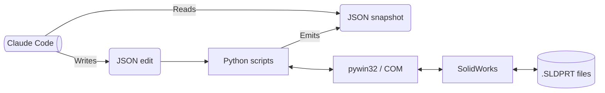

# SolidWorks CAD-edit toolkit, driven by an AI agent

## What this is

SolidWorks is a CAD program used for designing mechanical parts. Close to everyone who uses it drives it manually from inside the application. This project is a Python toolkit that lets Claude Code read, render, edit, and verify SolidWorks parts from outside the application. Claude uses the Windows COM bridge that SolidWorks includes, and produces JSON snapshots Claude can read, and edit. The COM bridge is well-known but is still undocumented at the edges which is why this project is interesting.

## What I set out to prove

I started this project to answer two questions. First, can Claude make edits to a SolidWorks part (rename features, change dimensions, drill holes, change materials, etc.)? Second, can I push Claude to reason complex problems and act upon thought out decisions after given a desired outcome. For example, keeping important geometry and materials constant, but reducing mass. As well as, design a bracket that needs to fit certain constraints. Generic edits have been mainly achieved, but complex problem solving with action are still something to be explored more in-depth.

## How it works

To automate SolidWorks with Claude I selected Python-based automation out of three main approaches: Model Context Protocol (MCP), Python, Batch+. Python was selected due to a good balance of flexibility, and direct access to the SolidWorks API while staying simple.

The overall architecture uses JSON files as an interface between Claude and SolidWorks. First the Python toolkit extracts part information (geometry, dimensions, configurations, metadata) from the model and generates a JSON snapshot. This snapshot is used by Claude to understand the model better without direct interaction inside of SolidWorks. Standard view renders are also generated to provide visual context for more complex geometries.

When a design change is requested, Claude produces a JSON edit files with required changes. The Python script layer interprets the edits and communicates with SolidWorks through the pywin32 COM interface. Before changes are made, the original model is backed up, in case of issues that may arise. The modifications are then applies, the model is rebuilt, and checks are performed to confirm there are no errors.

This system enables Claude to use Python as a toolkit for interacting with SolidWorks. Claude interprets model information, generates modifications, while Python exectures the changes through SolidWorks API.



A declarative edit operation looks like this:

```json
{"op": "set_dimension", "name": "D1@Base", "value": 100, "units": "mm"}
```

## What I learned

**Claude can successfully perform CAD operations through external toolkit - **This project showed that Claude is capable of reading information about a SolidWorks part and making changes through a Python toolkit. Common edits such as renaming features and changing dimensions were successfully performed. More tools can be added over time to expose additional SolidWorks functionality. Overall, the project demonstrated that a large language model can do more than provide suggestions — it can actually interact with CAD software and make changes to a model.

**Simple edits achievable now, complex reasoning remains open ended - **Claude can follow instructions and perform requested design changes, but the more interesting question is whether it can make engineering decisions on its own to achieve a desired outcome. For example, reducing the mass of a part while keeping important geometry unchanged, or creating a bracket that satisfies a set of design constraints. The framework appears capable of supporting these types of tasks, but additional SolidWorks functionality needs to be integrated before they can be tested thoroughly.

**Expanding toolkit is necessary for real workflows - **A large amount of development time was spent building Python tools that allow Claude to interact with SolidWorks. While the basic system works, expanding it to cover more SolidWorks features will require additional effort. Many engineering tasks are already possible, but more advanced workflows will depend on giving Claude access to a broader set of CAD operations. The project suggests that the limiting factor is often not Claude's ability to understand a problem, but whether the necessary tools exist for it to act on that understanding.

## What didn't fit

- The original goal included seeing whether Claude could make engineering decisions to achieve a desired outcome. Most testing so far focused on building a basic toolkit and validating individual operations on CAD rather than fully exploring these workflows.
- The current toolkit covers only a small set of SolidWorks functions. While common operations are supported, many advanced features (i.e. Hole Wizard) would require more time to integrate before complex design tasks can be attempted.
- The project was mainly tested on part files. Assemblies, drawings, mating, and larger scope projects remain areas for development.

## Where to go from here

- `STATUS.md` — cold-start guide and current code state
- `QUIRKS.md` — full reference for the SolidWorks/Python COM boundary
- `CLAUDE.md` — working notes that guide Claude inside the repo

MIT License — Timothy Zimine, 2026.
